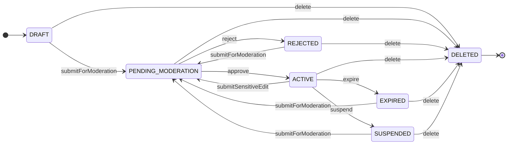

# Ad lifecycle

Status transitions are enforced by `AdStatus` and invoked through named methods on the `Ad` aggregate.

Source of truth:

- [`AdStatus.java`](domain/model/AdStatus.java) — transition graph (`mayBecome`) and operation entry rules (`canSubmitForModeration`, `canSubmitSensitiveEdit`)
- [`Ad.java`](domain/model/Ad.java) — behavior and domain events

## State diagram



## Statuses

| Status | Meaning |
|---|---|
| `DRAFT` | Owner is editing; not submitted for review |
| `PENDING_MODERATION` | Submitted and waiting for moderator decision |
| `ACTIVE` | Approved and visible (live) |
| `REJECTED` | Moderation failed; owner can fix and resubmit |
| `SUSPENDED` | Live ad blocked for policy violation; owner must edit and resubmit or delete |
| `EXPIRED` | Validity period ended |
| `DELETED` | Terminal; removed by owner or withdrawn |

## Domain operations

| Method | From | To | Domain event |
|---|---|---|---|
| `submitForModeration(now)` | `DRAFT`, `REJECTED`, `EXPIRED`, `SUSPENDED` | `PENDING_MODERATION` | `AdSubmittedForModerationEvent` |
| `submitSensitiveEdit(title, description, now)` | `ACTIVE` | `PENDING_MODERATION` | `AdUpdatedEvent` (if changed), `AdSubmittedForModerationEvent` |
| `approve(now)` | `PENDING_MODERATION` | `ACTIVE` | `AdActivatedEvent` |
| `reject(reason, now)` | `PENDING_MODERATION` | `REJECTED` | `AdRejectedEvent` |
| `suspend(reason, now)` | `ACTIVE` | `SUSPENDED` | `AdSuspendedEvent` |
| `expire(now)` | `ACTIVE` | `EXPIRED` | `AdExpiredEvent` |
| `delete(now)` | any non-terminal source | `DELETED` | `AdDeletedEvent` |

Non-sensitive edits (`changeTitle`, `changeDetails`, `changePrice`) do not change status.

## Allowed transitions

Encoded in `AdStatus.mayBecome()`:

```text
DRAFT              -> PENDING_MODERATION, DELETED
PENDING_MODERATION -> ACTIVE, REJECTED, DELETED
REJECTED           -> PENDING_MODERATION, DELETED
ACTIVE             -> PENDING_MODERATION, SUSPENDED, DELETED, EXPIRED
EXPIRED            -> PENDING_MODERATION, DELETED
SUSPENDED          -> PENDING_MODERATION, DELETED
DELETED            -> (none)
```

## Rules

- Operation entry for moderation is decided by `AdStatus.canSubmitForModeration()` / `canSubmitSensitiveEdit()`; the status graph remains `mayBecome()`.
- Publishing always goes through moderation: `DRAFT -> PENDING_MODERATION -> ACTIVE`.
- Rejection happens only while pending moderation, not from `ACTIVE`.
- A live ad returns to moderation only via `submitSensitiveEdit`, not `submitForModeration`.
- After suspension, the owner can resubmit for review or delete; there is no direct path back to `ACTIVE`.
- Renewal after expiry routes through `PENDING_MODERATION`, not straight to `ACTIVE`.
- Resubmit after rejection routes to `PENDING_MODERATION`, not back to `DRAFT`.

## Typical flows

**First publish**

```text
createDraft -> assignId -> submitForModeration -> approve
```

Draft create (`createDraft` + `assignId`) persists to Postgres only — no integration / outbox event.
The first Modulith `event_publication` row is written when `submitForModeration` raises
`AdSubmittedForModerationEvent` (mapped to `AdSubmittedForModerationIntegrationEvent`).

**Fix after rejection**

```text
REJECTED -> submitForModeration -> approve
```

**Sensitive edit on live ad**

```text
ACTIVE -> submitSensitiveEdit -> approve
```

**Renew expired ad**

```text
EXPIRED -> submitForModeration -> approve
```

**Violation on live ad**

```text
ACTIVE -> suspend -> submitForModeration -> approve
```

**Abandon without changes (suspended)**

```text
SUSPENDED -> delete
```
